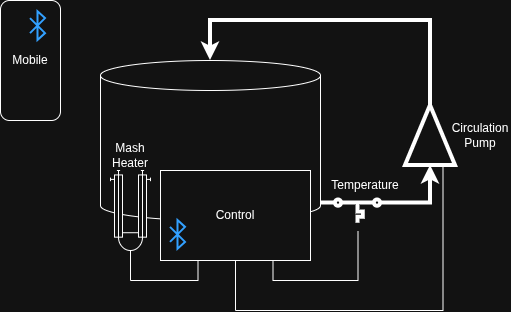

# BrewControl
This project focuses on the development of an automated control system for a brewing heating kettle. The system regulates both the temperature of the kettle and the operation of the circulation pump to ensure precise and consistent process control during brewing.

Temperature control is managed dynamically according to predefined brewing parameters, while the circulation pump is controlled to maintain uniform heat distribution throughout the system. This enables accurate mash temperature control and improves overall brewing stability and repeatability.

The entire process is configured through a brewing recipe created in a mobile application. Users can define temperature steps, holding times, and pump operation parameters within the app. The recipe is then uploaded directly to the control system, where it is executed automatically.

The goal of the project is to combine precise thermal process control with a user-friendly digital interface, enabling flexible, repeatable, and efficient home brewing automation.

## Control options
- Temperature
- Time
- Auto/manual confirmation of mashing step
- Circulation intensity

## Hardware
- ESP32
- Temperature sensor
- Circulation Pump
- Heater
- Mobile phone
